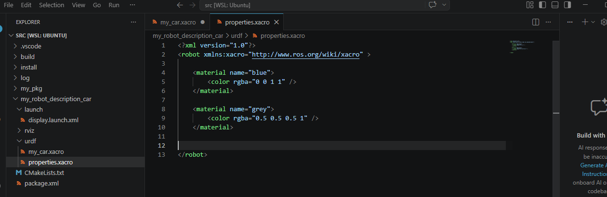
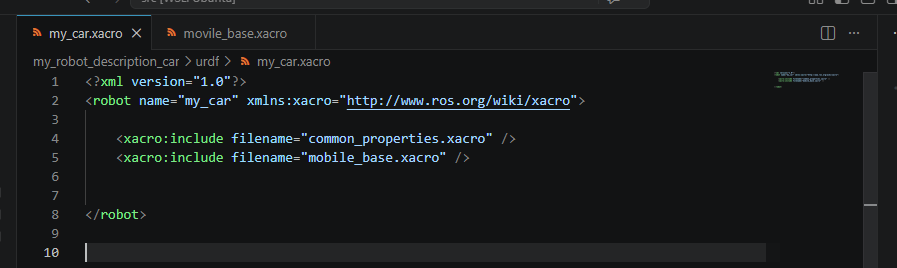

## Modularidad del Código: División de Archivos

A medida que el modelo de un robot adquiere una mayor cantidad de propiedades anatómicas y funciones, intentar manejar gran cantidad de líneas de código bajo un primitivo archivo único (`my_car.xacro`) produce saturación, complicando gravemente su lectura y mantención. 

La herramienta URDF Xacro incluye un atributo muy amigable llamado "Includes", que nos provee una técnica fenomenal: Dividir la densidad del modelo creando un sistema modular repartido por especialidad funcional que luego se "llamará" al archivo maestro central.

Para nuestro caso de desarrollo actual, realizaremos una purga general separando nuestra estructura en dos nuevos archivos. Crea ambos dentro de la carpeta local de tu proyecto `urdf`:
- `common_properties.xacro`: Centralizará variables abstractas y las asignaciones `material` que procesan las gamas estéticas de los componentes.
- `mobile_base.xacro`: Recluirá todo el denso ecosistema físico principal (los links, eslabones geométricos y las uniones articulares que dictan movimiento estático).

### 1. Migración Visual: `common_properties.xacro`

Crea este fichero designado `common_properties.xacro`. Vas a aislar aquí todo el mapeo conceptual estético, mudando la información respecto al tratamiento visual o atributos directos genéricos del archivo base.



Un vez copiado el cuerpo de este código, elimínalo totalmente para despejar el principal `my_car.xacro`. Ahora solo deberás establecer el puente indicándole a este último en dónde están sus propiedades, agregando la sencilla declaración universal:

```xml
<xacro:include filename="common_properties.xacro" />
```

### 2. Extracción Geométrica Masiva: `mobile_base.xacro`

Aplica el mismo estándar en el recién elaborado archivo `mobile_base.xacro`. Extrae íntegramente de tu fuente los amplios sistemas masivos que creaste antes. Nos referimos a reubicar todos los fragmentos físicos mecánicos estructurales para darle lugar solo a esta hoja respectiva (el `base_footprint`, el `<macro>` clonador de ruedas, tus llantas traseras con joint, tu `base_link`, y la rueda loca esférica frontal `caster_wheel_link`).

Acuérdate de introducir su propio vínculo `<xacro:include filename="mobile_base.xacro" />` en la estructura original para enlazar todo tu sistema de movimiento de vuelta.

### 3. Esqueleto de Simplificación Óptima

Es altamente satisfactorio analizar este enorme progreso logístico. Tu documento general (`my_car.xacro`) fue drenado de componentes hasta vaciar la enorme masa ilegible en formato texto y quedar resumido casi exclusivamente a referencias incluyentes (`<xacro:include />`). El mismo se asemeja ahora a una consola indexadora profesional en vez de un caos no estructurado.



### 4. Compilación del Sistema Multi-archivo

Como introdujimos nuevos recursos operacionales al sistema de archivos del paquete URDF, es vital forzar la directiva constructora de ROS para regenerar sus rutas absolutas, reconociendo exitosamente la presencia y dependencias de las entidades recién creadas. 

Abre la terminal de Ubuntu, dirígete a la carpeta principal de tu espacio de trabajo (abc_ws) y ejecuta el siguiente comando para compilar el proyecto::

```bash
colcon build --symlink-install
source install/setup.bash
```
De aquí en adelante disfrutarás un nivel de control robótico altamente expandible.