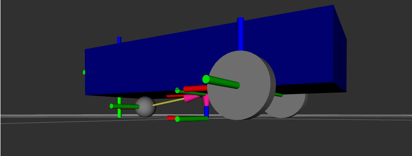

## Parametrización de la Altura del Robot

Para completar todas las dimensiones 3D de nuestro chasis, continuaremos definiendo su atributo de altura (`base_height`). Convertir este dato estático en una variable paramétrica garantizará que, si necesitamos crecer o encoger verticalmente la base, su colisión y posicionamiento en relación al suelo se auto-calculen de manera dinámica sin errores de interferencia.

### 1. Declaración de la variable `base_height`

Junto al bloque de propiedades creados en las lecciones previas, añade esta nueva variable numérica asignándole el valor referencial `0.2`:

```xml
<xacro:property name="base_height" value="0.2" />
```

### 2. Elevación Inteligente sobre el Suelo (Origen Z)

En la robótica simulada, el origen espacial (0,0) de las geometrías primitivas como nuestra caja (`<box>`) radica precisamente en el punto central de todo su volumen interior. **¿Qué sucede por lo tanto si establecemos el eje `Z = 0` directamente para su visualización?** La mitad inferior de nuestro rectángulo principal terminará alojado por debajo de las ruedas, traspasando virtualmente el piso.

Para solucionar de raíz cualquier colisión de texturas, debemos alzar nuestra caja empujándola en la misma medida que dicte la *mitad de su altura definida*. Al estar basándonos en variables, no usaremos simplemente `0.1`... Aplicaremos dinámicamente nuestra variable dividida creando una ecuación aritmética: `${base_height / 2.0}`.

Modifica tanto la etiqueta de volumen (`<geometry>`) aplicando la última variable, como de origen (`<origin>`) en la estructura del `base_link`, para que dejen de usar números fijos y queden completamente en base a nuestra triple parametrización, como se muestra a continuación:

```bahs
<link name="base_link">
    <visual>
        <geometry>
            <box size="${base_length} ${base_width} ${base_height}" />
        </geometry>
        <!-- Elevamos la caja la medida exacta requerida de acuerdo a base_height -->
        <origin xyz="0 0 ${base_height / 2.0}" rpy="0 0 0" />
    </visual>
</link>
```

---

### ¡Pon a prueba el entorno paramétrico!

Con `base_length`, `base_width` y `base_height` completadas y correlacionadas analíticamente con las ecuaciones de diseño (el posicionamiento modificado en origen), tienes ahora un chasis que procesa solo y responde inteligentemente.

Para ver los frutos de estas implementaciones, puedes ejecutar esta prueba experimental rápida:

1. Ve hacia el archivo `my_car.xacro` y exagera intencionalmente el número de la longitud cambiando su variable a `1.0`:

   `<xacro:property name="base_length" value="1.0" />`

2. Guarda el archivo y ejecuta tu sistema de lanzamiento para abrir nuestro entorno en RViz.



Podrás notar en el acto el verdadero propósito y potencial de Xacro: Tu chasis no solo creció mucho más alargado, **el mecanismo calculó en el background todas nuestras ecuaciones de división relocalizando al vuelo de manera idéntica la distribución de tus tres apoyos rodantes**. Todas y cada una las ruedas calcularán sus propios offsets manteniendo de forma escalada sus espacios con los nuevos bordes; sin requerir que modifiques coordinadas para cada llanta a mano. 

*(Recordatorio: Al finalizar el experimento con el lanzamiento, no olvides revertir tu longitud referencial temporal de `1.0` de vuelta a su valor original de `0.6` para estar coordinado en futuras guías).*