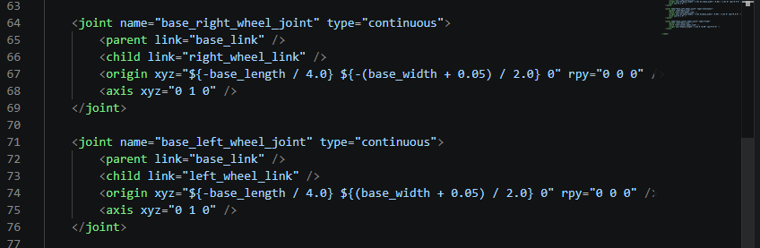

## Parametrización del Ancho del Robot

Continuando con la parametrización de nuestro modelo, ahora definiremos nuestra segunda variable: el ancho paramétrico de la base principal. Al igual que hicimos en la sección anterior con la longitud, establecer el ancho como una propiedad de Xacro nos permitirá ajustar las dimensiones laterales del robot con gran facilidad, logrando que sus componentes se readapten solos a los nuevos tamaños.

### 1. Declaración de la variable `base_width`

Originalmente, nuestra base tiene estipulado un ancho fijo de `0.4`. Para hacer dinámico este parámetro, insertaremos una nueva propiedad en la cima de nuestro archivo `my_car.xacro` (junto a la reciente creación de `base_length`):

```xml
<xacro:property name="base_width" value="0.4" />
```

Con la variable ya disponible en el sistema, buscamos la etiqueta `<geometry>` dentro del bloque `base_link` y sustituimos el valor numérico correspondiente al ancho por el acceso a nuestra nueva variable `${base_width}`. De este modo, la declaración de la geometría de caja quedará de la siguiente manera:

```bahs
<link name="base_link">
    <visual>
        <geometry>
            <box size="${base_length} ${base_width} 0.2" />
        </geometry>
    </visual>
</link>
```


### 2. Reposicionamiento Automático de las Ruedas Laterales



Al modificar el ancho de la estructura central, es absolutamente necesario ajustar en conjunto la posición de anclaje de las ruedas motrices derecha e izquierda. De lo contrario, si ampliamos la caja y las ruedas siguen fijas, estas terminarán solapadas dentro de la estructura general (o quedarán flotando distanciadas si decidimos encoger la caja).

La ubicación de anclaje lateral de las ruedas está especificada en la coordenada `Y` del nodo de juntas (`<origin>`). Originalmente utilizábamos los valores fijos `0.255` (y su equivalente negativo). Para lograr un sistema automático en base al ancho cambiante, sustituimos ese número dependiente por la siguiente ecuación paramétrica:

```xml
<!-- Expresión matemática que reemplazará a 0.255 -->
${(base_width + 0.05) / 2.0}
```

**¿Cómo funciona la fórmula de anclaje?**
- **`base_width / 2.0`**: Esta división principal calcula la mitad teórica de la estructura de la base, ubicando el anclaje central justo sobre el límite extremo lateral de la caja metálica.
- **`+ 0.05`**: Corresponde al grosor físico de la rueda actual (este es el valor asignado en el `length` de los cilindros de la rueda). Al integrarlo a la división en 2, forzamos al sistema a empujar toda la posición de la rueda hacia el exterior por el equivalente de la mitad de su grosor. Esto garantiza un alineamiento perfecto sin sobreponer las geometrías.

::: {.callout-note}
Asegúrate de aplicar la expresión respectiva para el origen interno de ambas ruedas, recordando utilizar el prefijo del signo negativo `${-(base_width + 0.05) / 2.0}` en el eslabón de la rueda en la que originalmente tenías insertado un valor inicial negativo para así mantener íntegra tu simetría bilateral.
:::
