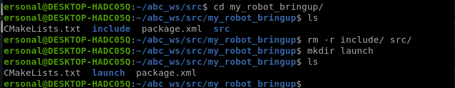
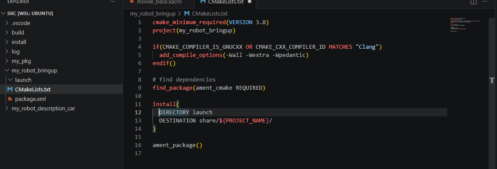
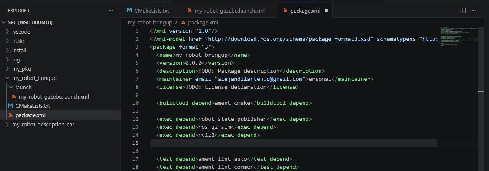

# Creación del Paquete Bringup y Launch File

Para organizar de manera profesional y estructurada los archivos que arrancan nuestro robot, vamos a crear un paquete dedicado en ROS 2 llamado `my_robot_bringup`. Sigue estos pasos detalladamente:

## 1. Crear el paquete

Abre una terminal, dirígete a la carpeta `src` de tu espacio de trabajo y ejecuta el siguiente comando para crear el paquete:

```bash
cd ~/abc_ws/src
ros2 pkg create my_robot_bringup
```



## 2. Configurar el CMakeLists.txt

Abre el archivo `CMakeLists.txt` de tu nuevo paquete `my_robot_bringup`. Elimina los comentarios innecesarios para que quede limpio y añade la siguiente regla de instalación. Esto le dice a ROS 2 dónde ubicar tu archivo de launch cuando se compile el proyecto:

```cmake
install(DIRECTORY launch
    DESTINATION share/${PROJECT_NAME}/
)
```



## 3. Añadir dependencias en package.xml

Abre el archivo `package.xml` de tu nuevo paquete y añade las siguientes dependencias de ejecución. Esto asegura que el paquete reconozca los utilitarios de simulación:

```xml
  <exec_depend>robot_state_publisher</exec_depend>
  <exec_depend>ros_gz_sim</exec_depend>
  <exec_depend>ros_gz_bridge</exec_depend>
  <exec_depend>rviz2</exec_depend> 
```




## 4. Crear el archivo Launch

Dentro de la carpeta de tu paquete `my_robot_bringup`, crea un nuevo directorio llamado `launch`. Dentro de él, crea un archivo XML llamado `my_car_gazebo.launch.xml` y añade el siguiente código:

```xml
<launch>
    <let name="urdf_path" 
         value="$(find-pkg-share my_robot_description_car)/urdf/my_car.xacro" />
    <let name="gazebo_config_path"
         value="$(find-pkg-share my_robot_bringup)/config/gazebo_bridge.yaml" />
    <let name="rviz_config_path" 
         value="$(find-pkg-share my_robot_description_car)/rviz/urdf_config_car.rviz" />

    <node pkg="robot_state_publisher" exec="robot_state_publisher">
        <param name="robot_description"
               value="$(command 'xacro $(var urdf_path)')" />
    </node>

    <node pkg="joint_state_publisher" exec="joint_state_publisher" name="joint_state_publisher">
          <param name="robot_description_car" value="true"/>
    </node>

    <include file="$(find-pkg-share ros_gz_sim)/launch/gz_sim.launch.py">
        <!--<arg name="gz_args" value="$(find-pkg-share my_robot_bringup)/world/test_my_world_gz.sdf" /> -->
          <arg name="gz_args" value="empty.sdf -r" />
    </include>

    <node pkg="ros_gz_sim" exec="create" args="-topic robot_description" />

    <node pkg="ros_gz_bridge" exec="parameter_bridge">
        <param name="config_file" value="$(var gazebo_config_path)" />
    </node>

    <node pkg="rviz2" exec="rviz2" output="screen"
          args="-d $(var rviz_config_path)" />
</launch>
```

## 5. Compilar el espacio de trabajo

Regresa a la carpeta raíz de tu `workspace` (`~/abc_ws`) y compila tu proyecto.

```bash
colcon build
```

Luego, es obligatorio actualizar tu entorno del terminal y recargar tu instalación:

```bash
source /opt/ros/jazzy/setup.bash
source install/setup.bash
```

## 6. Ejecutar todo con un solo comando

¡Ya lo tienes todo configurado! Ejecuta el archivo que creaste para abrir la visualización del robot tanto en Gazebo como en RViz. 

```bash
ros2 launch my_robot_bringup my_car_gazebo.launch.xml
```

## 7. Configuración final en RViz

Cuando RViz se abra, es posible que el panel de visualización esté vacío. Para visualizar tu robot necesitas agregar unos pocos elementos:

1. Ve a la parte inferior izquierda de y haz clic en el botón **Add**.
2. En la lista, busca y añade **RobotModel** y **TF** (Transforms).
3. En el panel izquierdo bajo *Global Options*, cambia el **Fixed Frame** para que diga `base_footprint`.
4. Despliega el menú de tu **RobotModel**, ve a **Description Topic** y selecciona `/robot_description`.

Una vez hagas esto, ¡tu vehículo renderizará perfectamente!