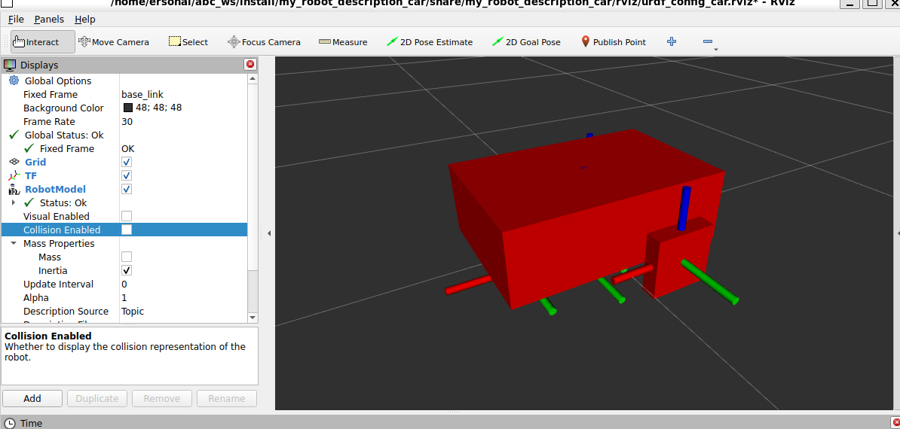

## Inercia en Cilindros: Parametrizando las Ruedas



Para que nuestro vehículo accione su modelo contra el suelo de forma lógica, así como le dimos densidad gravitacional al chasis frontal, debemos proveer propiedades de impacto e inercia a la superficie de los neumáticos motrices. 

### 1. Desarrollando el Macro Cilíndrico (`cylinder_inertia`)

Al igual que construimos un encapsulado matemático generalizado de código Xacro para resolver polígonos ortogonales en el centro de control intermedio, formularemos la función hermana para solventar el volumen interior equivalente de los cilindros del conjunto motriz.

Dirígete nuevamente hacia el archivo maestro `common_properties.xacro` e inserta esta segunda Macro de cálculo a continuación de tu bloque previo (`box_inertia`):

```xml
<xacro:macro name="cylinder_inertia" params="m r l o_xyz o_rpy">
    <inertial>
        <mass value="${m}" />
        <origin xyz="${o_xyz}" rpy="${o_rpy}" />
        
        <!-- Matriz Inercial de volumen para un Cilindro Sólido -->
        <inertia ixx="${(m/12) * (3*r*r + l*l)}" ixy="0" ixz="0"
                 iyy="${(m/12) * (3*r*r + l*l)}" iyz="0"
                 izz="${(m/2) * (r*r)}" />
    </inertial> 
</xacro:macro>
```

**Analizando la algoritmia diferencial del bloque Cilíndrico:**

- A diferencia del encapsulado anterior enfocado en "Tramos X, Y o Z", esta está formulada para la estructuración paramétrica pura radial recibiendo radio (`r`), largo transversal (`l`), acoplados con nuestra masa pre-fijada (`m`) y compensaciones focales abstractas base (`o_xyz` y `o_rpy`).

- Las etiquetas primarias de Tensor (`ixx`, `iyy`, `izz`) desechan entonces el cruce ortogonal de las caras por ejecutar matemáticamente bajo cálculo la compleja variante estandarizada para referirnos dinámicamente sobre el radio central de un cilindro rodante continuo, promediando el cociente en tercios del cuadrado de dichos márgenes frente a la inyección física volumétrica en kilogramos.

### 2. Adhiriendo la matriz Inercial a la tracción Motriz

Nuevamente destaca la impresionante proeza logística que realizamos al programar [nuestras ruedas bajo un llamado unificado genérico de Xacro (`wheel_link`)]. Al tener una sola macro programada dictaminando la fisionomía virtual rodante de nuestra máquina, **no tendremos que programar manualmente la adición inercial cilíndrica dos veces**. Lo controlaremos de modo imperativo para ambas simultáneamente.

Abre el archivo constructivo organizador `mobile_base.xacro` e inspecciona tu sector concentrador asignado bajo la macro de llantas (`<xacro:macro name="wheel_link" ...>`). Ejecutaremos o llamaremos el proceso calculador (`<xacro:cylinder_inertia.../>`) bajo el marco secuencial estructural inferior tras consolidar nuestra capa de modelo visual nativo estético (`</visual>`). Así luciera finalizada la integración:

```xml
        <xacro:macro name="wheel_link" params="prefix">
        <link name="${prefix}_wheel_link">
            <visual>
                <geometry>
                    <cylinder radius="${wheel_radius}" length="${wheel_length}" />
                </geometry>
                <origin xyz="0 0 0" rpy="${pi / 2.0} 0 0" />
                <material name="grey" />
            </visual>
<!-- Implementación del llamado dinámico a la Propiedad Inercial física -->
            <xacro:cylinder_inertia m="1.0" r="${wheel_radius}" l="${wheel_length}"
                                    o_xyz="0 0 0" o_rpy="${pi / 2.0} 0 0" />
        </link>
    </xacro:macro>
<!-- Cierre absoluto de xacro:macro de las llantas referencial -->     
        

```

**¿Qué significan los valores que enviamos a la macro?**

- **Masa (`m="1.0"`):** Le indicamos al simulador que cada rueda tiene un peso (masa) de 1 kilogramo.

- **Radio y Ancho (`r` y `l`):** En lugar de usar medidas fijas, le pasamos directamente las variables del radio (`${wheel_radius}`) y el ancho (`${wheel_length}`) que ya habíamos creado. De esta manera, el simulador sabe las medidas exactas y realiza el cálculo de la inercia basándose en el tamaño real de tu rueda.

- **Orientación (`o_rpy`):** Recuerda que al crear el cilindro original, este aparecía "de pie" (como un vaso en una mesa). Para que luzca como una llanta y gire correctamente, tuvimos que rotarlo 90 grados (escrito como `pi/2.0`). En la inercia hacemos exactamente lo mismo: rotamos su caja invisible de físicas 90 grados, alineando perfectamente el comportamiento físico con el objeto 3D que ven nuestros ojos.