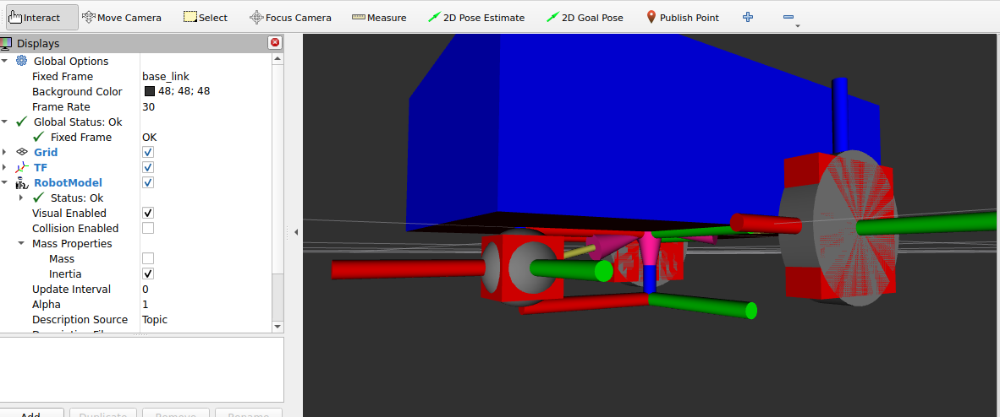

## Inercia en Esferas: Parametrizando la Rueda Loca



Para concluir por completo con nuestro proceso físico de asignación de masas y dotar de comportamiento dinámico universal al robot, terminaremos enfocándonos en proveerle volumen inercial a nuestra rueda loca motriz frontal (*Caster Wheel*).

Puesto que esta rueda de apoyo inferior fue modelada estéticamente bajo el uso del componente tridimensional primitivo esférico (`<sphere>`), no responderá de forma física certera evaluándolo como a las lógicas mecánicas de la "Caja" o del "Cilindro". Las esferas simétricas puras requieren obligadamente que se procese la matemática respectiva de su propia y exclusiva matriz de colisión (Tensor inercial).

### 1. Desarrollando el Macro Esférico (`sphere_inertia`)

Procederemos a estructurar nuestra tercera y última macro de auto-cálculo para inercia depositándola directamente en `common_properties.xacro`. Ingresa este último formato volumétrico calculador integrándolo en la parte inferior de tu listado macro actual:

```xml
<xacro:macro name="sphere_inertia" params="m r o_xyz o_rpy">
    <inertial>
        <mass value="${m}" />
        <origin xyz="${o_xyz}" rpy="${o_rpy}" />
        
        <!-- Matriz tensora inercial algorítmica para Esferas Simétricas Sólidas -->
        <inertia ixx="${(2/5) * m * r * r}" ixy="0" ixz="0"
                 iyy="${(2/5) * m * r * r}" iyz="0"
                 izz="${(2/5) * m * r * r}" />
    </inertial>
</xacro:macro>
```

**Analizando la simplificación logarítmica del Tensor Esférico:**

- A diferencia de los modelos poligonales que exigían una asimilación forzada con variables extra como largos de cara asimétricos (`l`) o sus caras tridimensionales rectangulares exclusivas (`x, y, z`), una figura perfectamente curva de un punto neutro es idéntica en proporciones en todo momento indistintamente del ángulo de contacto. Sólamente va a requerir alimentarse del peso paramétrico (`m`) interconectado geométricamente a su variable medida central originaria: Su radio rotativo estético (`r`).

- Como es posible evidenciar dentro de las respectivas etiquetas focales en los vectores limitantes (`ixx`, `iyy`, e `izz`), al reaccionar idénticamente igual sobre los costados paralelos, la física universaliza el dictamen general promediando repetitivamente bajo la ecuación oficial `(2/5 * Masa * Radio al cuadrado)` para generar los tres planos del tensor.

### 2. Aplicando Inercia Sólida al Eslabón Frontal

Nuestra rueda bola omnidireccional dictaminadora (rueda loca delantera de apoyo) es lógicamente quien absorberá la herencia generativa de esta programación teórica.

Deberás ubicar el cuerpo físico del frente `<link name="caster_wheel_link">` que alojaste re-ordenadamente en tu módulo integrador de carrocería `mobile_base.xacro`. Posteriormente procede a emular la inserción macroesférica (`<xacro:sphere_inertia... />`) dándole cabida temporal estricta justo durante el cierre del encapsulado `<visual>`.

La organización del enlace eslabón resultaría bajo el siguiente espectro:

```xml
<link name="caster_wheel_link">
    <!-- El espacio que recubre previamente a </visual> queda indemne -->
    
    <!-- Integración Lógica Gravitacional Esférica al frente asfáltico -->
    <xacro:sphere_inertia m="0.5" r="${wheel_radius / 2.0}"
                          o_xyz="0 0 0" o_rpy="0 0 0" />
</link>
```

**Explicación de los parámetros utilizados:**

- **Masa (`m="0.5"`):** La rueda loca o de apoyo (*caster wheel*) es pequeña y no soporta el peso principal del robot (como el chasis o las baterías). Por eso, le asignamos un peso ligero de *0.5 kg*. Esto ayuda a que el robot se mueva suavemente en Gazebo sin problemas de balance.

- **Radio de la esfera (`r`):** En lugar de escribir un número fijo, usamos la fórmula: `${wheel_radius / 2.0}`. Esto asegura que el tamaño de la rueda loca se ajuste automáticamente a la mitad del tamaño de las ruedas principales, evitando que el robot quede desnivelado.

- **Orientación (`o_rpy="0 0 0"`):** Dado que es una esfera perfecta, se ve y se comporta igual sin importar hacia dónde la rotemos. Por lo tanto, no necesitamos aplicarle rotaciones extra y dejamos todos los valores en ceros (`0 0 0`).
