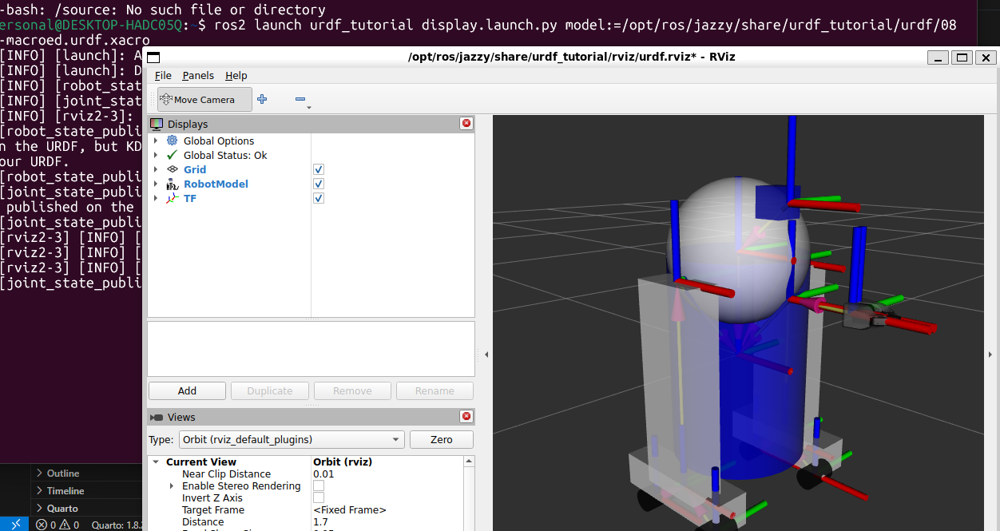

# Que es URDF

El URDF (Unified Robot Description Format) es un formato basado en XML utilizado en ROS 2 para describir de manera estructurada la configuración cinemática y dinámica de un robot. A través de este formato, se definen los links (cuerpos rígidos) y los joints (articulaciones) que los conectan, especificando propiedades como geometría, masas, inercias y relaciones de transformación entre sistemas de coordenadas. Esta representación permite a herramientas como Gazebo y RViz interpretar el modelo del robot para su visualización, simulación y análisis, facilitando el cálculo de transformaciones espaciales y el desarrollo de algoritmos de control y percepción.

# Que es RViz

RViz (ROS Visualization) es una herramienta de visualización 3D utilizada en ROS 2 para representar el estado de un robot y sus datos en tiempo real.

Desde un enfoque técnico, RViz permite visualizar información proveniente de distintos nodos de ROS, como modelos URDF, nubes de puntos, mapas, trayectorias, sensores (LIDAR, cámaras) y transformaciones del sistema TF2. Esta herramienta se basa en la suscripción a tópicos, lo que le permite actualizar dinámicamente la escena en función de los datos que recibe, facilitando el análisis del comportamiento del robot dentro de su entorno.

Además, RViz utiliza el árbol de transformaciones (TF2) para posicionar correctamente cada elemento en el espacio, garantizando coherencia entre los distintos sistemas de coordenadas. Esto lo convierte en una herramienta fundamental para depuración, monitoreo y validación de algoritmos de percepción, localización y navegación en robótica.



Para visualizar un robot en RViz, primero se debe abrir una terminal en Ubuntu y ejecutar el comando:

```bash
ros2 launch urdf_tutorial display.launch.py model:=/opt/ros/jazzy/share/urdf_tutorial/urdf/08-macroed.urdf.xacro
```
el cual lanza un archivo de configuración que carga el modelo del robot definido en formato XACRO.

Al ejecutar este comando, se abrirá la interfaz gráfica de RViz mostrando el modelo del robot en un entorno tridimensional. De manera simultánea, se desplegará una ventana adicional que contiene controles deslizantes (sliders), los cuales permiten manipular las articulaciones del robot en tiempo real. Esto facilita la visualización del movimiento de sus partes y la comprensión de su estructura cinemática.


# Que es la inercia

Cuando desarrollamos simulaciones y utilizamos únicamente a **RViz**, lo único que nos interesa son las etiquetas `<visual>` para mostrar estéticamente al modelo. Sin embargo, para que **Gazebo** (que es un motor físico riguroso) pueda calcular cómo interactúa tu robot con el ambiente, la gravedad, un derrape o una colisión, necesita obligatoriamente que definamos las propiedades químicas y tangibles de los engranajes.

Esta valiosa información física se encapsula en la etiqueta `<inertial>`.

**¿Para qué sirve y qué es la Inercia?**
Radica en la métrica funcional que determina cómo un objeto volumétrico se resiste o favorece el movimiento en un plano físico. Para esto, Gazebo necesita conocer tres claves de cada uno de tus Links:
1. **La Masa** (El peso real del componente en kilogramos).
2. **Su Punto Origen** (Dónde estará balanceado su centro de gravedad principal).
3. **Su Tensor de Inercia** (Una matriz geométrica de ecuaciones que determina cuán fácil o difícil es rotarlo en sus distintos ejes dependiente estricta de su forma).