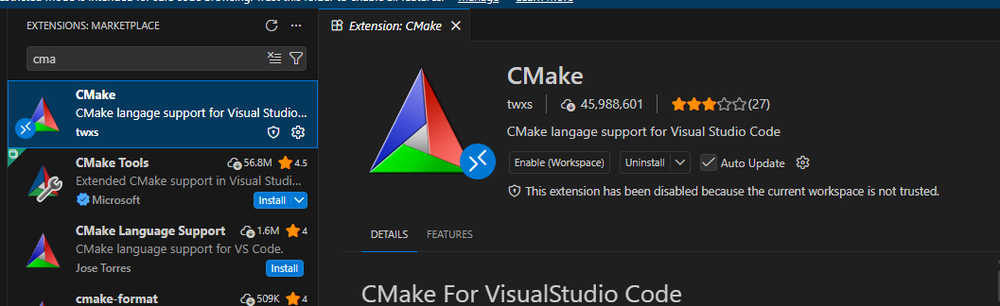
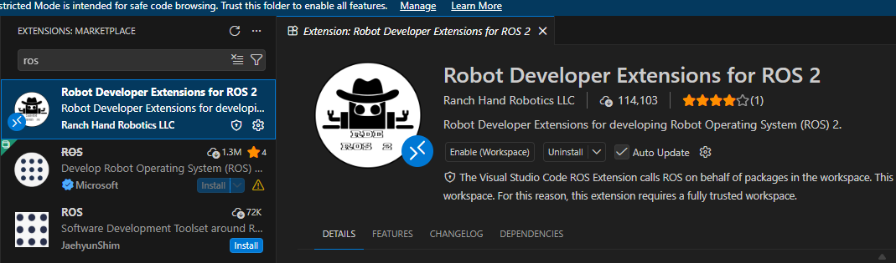

# Gazebo.

Gazebo es un simulador de robots en 3D que se utiliza junto con ROS 2 para diseñar, probar y validar robots sin necesidad de tenerlos físicamente. Permite crear un entorno virtual donde puedes colocar un robot, agregarle sensores (como cámaras o LIDAR), aplicar físicas reales (gravedad, fricción, colisiones) y observar cómo se comporta. Esto es especialmente útil porque puedes probar algoritmos de navegación, control o percepción de manera segura y económica antes de implementarlos en un robot real.

Una de sus principales ventajas es que simula condiciones bastante cercanas a la realidad, lo que permite detectar errores de diseño o programación sin riesgos. Además, al integrarse con ROS 2, puedes usar los mismos nodos, tópicos y servicios que usarías en un robot físico, haciendo que la transición entre simulación y realidad sea mucho más sencilla.

## Instalación de ROS-GZ
Para instalar Gazebo y las herramientas necesarias en ROS 2, primero se debe abrir una terminal en Ubuntu y ejecutar el siguiente comando. Durante este proceso, el sistema solicitará la contraseña del usuario para continuar con la instalación. Este paquete permite la integración entre ROS 2 y Gazebo, facilitando la simulación de robots en un entorno virtual.

```bash
sudo apt install ros-jazzy-ros-gz

source /opt/ros/jazzy/setup.bash 
```

## Instalación de URDF-TUTORIAL
Una vez completada la instalación anterior, se procede a instalar el siguiente paquete, el cual incluye ejemplos y recursos para trabajar con archivos URDF empleados en la descripción estructural del robot; asimismo, se instalan los paquetes necesarios para conectar ROS 2 con el simulador Gazebo, lo que establece la comunicación entre ambos sistemas y facilita el intercambio de datos, tales como información de sensores y comandos de control, dentro del entorno simulado.


```bash
sudo apt install ros-jazzy-urdf-tutorial

source /opt/ros/jazzy/setup.bash
```

## Instalación de TF2-TOOLS

Finalmente, se debe ejecutar el comando:

```bash
sudo apt install ros-jazzy-tf2-tools
```
Instala herramientas asociadas al sistema TF2. Este sistema es fundamental en robótica, ya que permite gestionar y visualizar las transformaciones entre los distintos sistemas de coordenadas de un robot, facilitando la comprensión de la relación espacial entre sus partes.

Para que todos estos paquetes funcionen correctamente, es necesario ejecutar el comando.

```bash
source /opt/ros/jazzy/setup.bash
```

El cual carga las variables de entorno de ROS 2 en la terminal. Sin este paso, los comandos de ROS no estarán disponibles. Con el fin de evitar ejecutar este comando manualmente en cada sesión, se recomienda agregar la línea al final del archivo .bashrc, lo que permite que el entorno se configure automáticamente al abrir una nueva terminal.




Como parte del entorno de trabajo para simulaciones con Gazebo, se recomienda instalar las extensiones “CMake Tools” y “ROS 2 Developer Tools”, ya que facilitan la gestión de proyectos, la compilación de paquetes y la navegación del código cuando se trabaja con modelos y simulaciones integradas con ROS 2.


