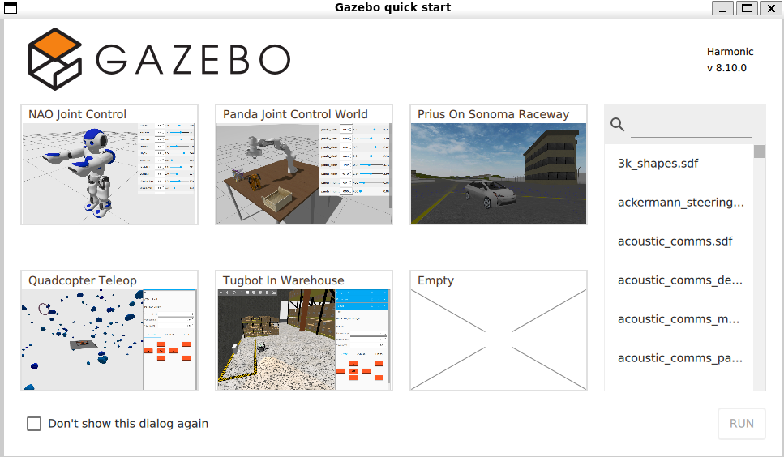

## Primeros Pasos con Gazebo

A diferencia de RViz (que es únicamente un visualizador de estados y transformaciones), **Gazebo es un motor de físicas avanzado y completamente independiente**. Funciona como un mundo simulado de la vida real donde el ordenador calcula gravedad, colisiones, inercia y dinámicas ambientales complejas. 

Es muy importante entender que Gazebo corre de forma autónoma al margen de tu instalación de ROS 2. Ambos sistemas operan separados, pero pueden interactuar e intercambiar comandos (como la lectura del láser de un sensor simulado, o el empuje exigido a una rueda) mediante lo que se conoce como el **puente de comunicación** (*ROS-Gazebo Bridge*).

A continuación, veremos cómo iniciar e ingresar a este poderoso entorno en su forma base.

### 1. Iniciar el Tablero Principal

Para levantar el ecosistema gráfico de Gazebo desde cualquier terminal, simplemente ejecuta el comando base para su entorno de simulación:

```bash
gz sim
```

Esta instrucción desplegará la pantalla principal (o dashboard general) del simulador. Desde este panel inicial podrás visualizar y acceder a distintos mundos de ejemplo, entornos y configuraciones predefinidas.



Una vez aquí, si haces clic en la opción que dice **"Empty"** y posteriormente en el botón **"Run"**, entrarás al espacio tridimensional de trabajo, que inicialmente consistirá en una cuadrícula plana al infinito. En este ambiente es donde pondremos a prueba la física de nuestro robot más adelante a través de sus propias herramientas de desarrollo.

### 2. Acceso Directo por Comandos (Atajo)

Durante un flujo de trabajo continuo, abrir el menú gráfica cada vez y buscar el mundo con el clic puede volverse tedioso. Por suerte, Gazebo permite iniciar la simulación ingresando directamente al escenario especificado sin pasar por la interfaz de bienvenida.

Para ingresar de un solo golpe al entorno vacío, añade el nombre del archivo geométrico del mundo (en este caso `empty.sdf`) junto a la instrucción de lanzamiento:

```bash
gz sim empty.sdf
```

::: {.callout-note}
**¿Qué es la extensión `.sdf`?**
Son las siglas de *Simulation Description Format* (Formato de Descripción de Simulaciones). Así como en ROS 2 utilizamos el estándar URDF/Xacro para armar minuciosamente a un robot, Gazebo utiliza su formato nativo XML propio (el SDF) para describir y retener las posiciones del suelo, el cielo, la luz direccional del Sol y las configuraciones atmosféricas de su universo.
:::
