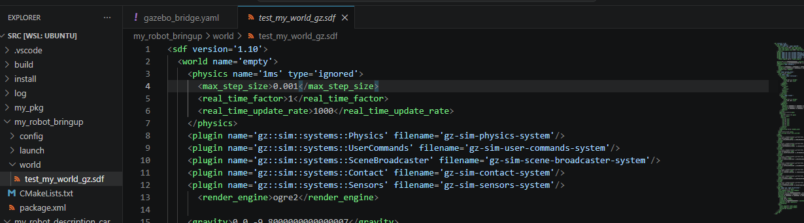
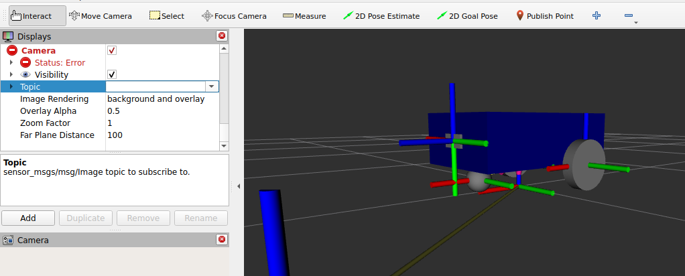

Para agregar una cámara en la parte delantera de nuestro robot, primero debemos crear un archivo llamado `camera.xacro` dentro del `urdf` del paquete de descripción de nuestro robot (`my_robot_description_car`).

Dentro de este archivo, pega el siguiente código:

```xml
<?xml version="1.0"?>
<robot xmlns:xacro="http://www.ros.org/wiki/xacro">

    <!-- Definición de las dimensiones físicas de la cámara -->
    <xacro:property name="camera_length" value="0.01" />
    <xacro:property name="camera_width" value="0.1" />
    <xacro:property name="camera_height" value="0.05" />

    <!-- Enlace (link) principal de la cámara, define su aspecto visual, masa y colisiones -->
    <link name="camera_link">
        <visual>
            <geometry>
                <box size="${camera_length} ${camera_width} ${camera_height}" />
            </geometry>
            <material name="grey" />
        </visual>
        <collision>
            <geometry>
                <box size="${camera_length} ${camera_width} ${camera_height}" />
            </geometry>
        </collision>
        <xacro:box_inertia m="0.1" x="${camera_length}" y="${camera_width}" z="${camera_height}"
                           o_xyz="0 0 0" o_rpy="0 0 0" />
    </link>

    <!-- Junta (joint) que une rígidamente la cámara a la base del robot en la parte frontal -->
    <joint name="base_camera_joint" type="fixed">
        <parent link="base_link" />
        <child link="camera_link" />
        <origin xyz="${(base_length + camera_length) / 2.0} 0 ${base_height / 2.0}" rpy="0 0 0" />
    </joint>

    <!-- Enlace óptico adicional comúnmente requerido para alinear los ejes de la imagen de Gazebo a las convenciones de ROS -->
    <link name="camera_link_optical" />

    <joint name="camera_optical_joint" type="fixed">
        <origin xyz="0 0 0" rpy="${-pi/2} 0 ${-pi/2}"/>
        <parent link="camera_link"/>
        <child link="camera_link_optical"/>
    </joint>

    <!-- Etiqueta Gazebo para añadir el sensor (plugin de cámara) al enlace físico -->
    <gazebo reference="camera_link">
        <sensor name="camera" type="camera">
            <camera>
                <horizontal_fov>1.3962634</horizontal_fov>
                <image>
                    <width>640</width>
                    <height>480</height>
                    <format>R8G8B8</format>
                </image>
                <clip>
                    <near>0.1</near>
                    <far>15</far>
                </clip>
                <noise>
                    <type>gaussian</type>
                    <mean>0.0</mean>
                    <stddev>0.007</stddev>
                </noise>
                <optical_frame_id>camera_link_optical</optical_frame_id>
                <camera_info_topic>camera/camera_info</camera_info_topic>
            </camera>
            <!-- Permite que la cámara inicie activa y pueda ser visualizada -->
            <always_on>1</always_on>
            <update_rate>20</update_rate>
            <visualize>true</visualize>
            <topic>camera/image_raw</topic>            
        </sensor>
    </gazebo>

</robot>
```

A continuación, necesitamos asegurar que los mensajes de imagen y de información de la cámara fluyan correctamente de Gazebo hacia ROS 2 mediante `ros_gz_bridge`. Abre tu archivo `gazebo_bridge.yaml` y agrega las siguientes configuraciones:

```yaml
# Puente para los datos de calibración e info de la cámara
- ros_topic_name: "/camera/camera_info"
  gz_topic_name: "/camera/camera_info"
  ros_type_name: "sensor_msgs/msg/CameraInfo"
  gz_type_name: "gz.msgs.CameraInfo"
  direction: GZ_TO_ROS

# Puente para los datos crudos de la imagen
- ros_topic_name: "/camera/image_raw"
  gz_topic_name: "/camera/image_raw"
  ros_type_name: "sensor_msgs/msg/Image"
  gz_type_name: "gz.msgs.Image"
  direction: GZ_TO_ROS
```

Finalmente, es crucial que el mundo de Gazebo cargue el plugin adecuado para procesar los sensores. En tu archivo `test_my_world_gz.sdf`, agrega las siguientes líneas dentro de la etiqueta general, de manera análoga a la imagen:



```xml
<plugin name='gz::sim::systems::Sensors' filename='gz-sim-sensors-system'>
    <render_engine>ogre2</render_engine>
</plugin>
```

---

Guarda todos los cambios, compila el espacio de trabajo y ejecuta el archivo *launch* para levantar Gazebo con tu nuevo robot instrumentado:

```bash
ros2 launch my_robot_bringup my_car_gazebo.launch.xml
```

Para visualizar la imagen de la cámara en Rviz2, haz clic en el botón **Add**, busca la opción **Camera** y selecciónala con doble clic para agregarla. Luego, en el panel izquierdo, despliega las propiedades de la cámara recién añadida, busca la configuración **Topic** y selecciona el tópico correspondiente a la imagen. Una vez configurado, la cámara se activará y comenzará a transmitir en tiempo real el mundo de gazebo.

