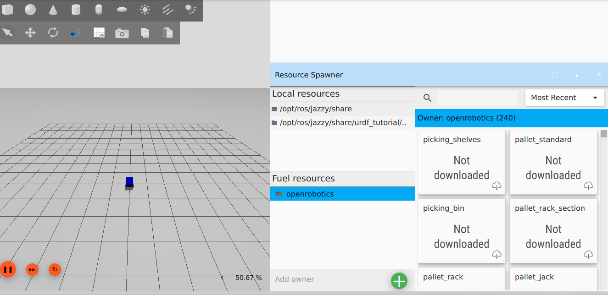
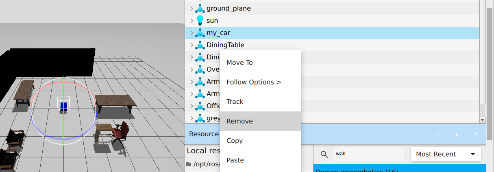
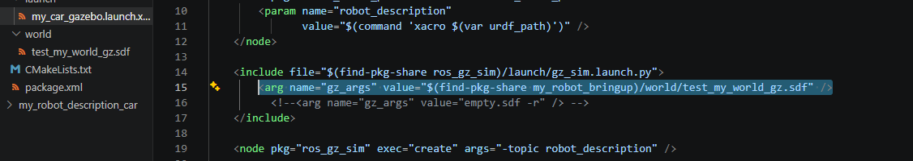

Para crear un mundo dentro de Gazebo (Gz), primero debemos tener nuestro robot en marcha en la simulación. Luego, nos dirigimos a los tres puntos ubicados en la esquina superior derecha de la interfaz.

Allí buscamos la herramienta **Resource Spawner**, que nos permitirá encontrar y agregar los elementos que deseamos incluir en nuestro mundo.



> [!NOTE]
> La búsqueda de los modelos que deseas agregar se debe realizar en inglés.

Una vez encuentres el modelo, puedes descargarlo y arrastrarlo hacia el panel donde se encuentra el robot. Utiliza las herramientas que aparecen en la parte superior del panel para mover o rotar los objetos según necesites.



Cuando hayas terminado de diseñar tu entorno, elimina el modelo del robot (`my_car`) de la simulación, de forma que solo guardemos el mundo en Gazebo.

Presiona `Ctrl + Shift + S` para guardar el archivo y asígnale el nombre `test_my_world_gz.sdf`.

> [!TIP]
> Tras cerrar Gazebo, es recomendable asegurar que el guardado fue exitoso. Abre una terminal en Ubuntu y ejecuta:
> ```bash
> gz sim test_my_world_gz.sdf
> ```
> Debería abrirse Gazebo mostrando únicamente el mundo que acabas de crear.

A continuación, vamos a integrar este mundo en nuestro paquete. Dentro del directorio `my_robot_bringup`, crea una nueva carpeta llamada `world`. Traslada el archivo `test_my_world_gz.sdf` copiándolo desde tu ubicación de guardado hacia esta nueva carpeta `world`.

Finalmente, en el archivo `my_car_gazebo.launch.xml` vamos a activar la siguiente línea para que el lanzamiento de Gazebo incluya el mundo que creamos:



```xml
<arg name="gz_args" value="$(find-pkg-share my_robot_bringup)/world/test_my_world_gz.sdf" />
```
---

Guarda los cambios, compila el espacio de trabajo y ejecuta el archivo *launch*:

```bash
ros2 launch my_robot_bringup my_car_gazebo.launch.xml
```


